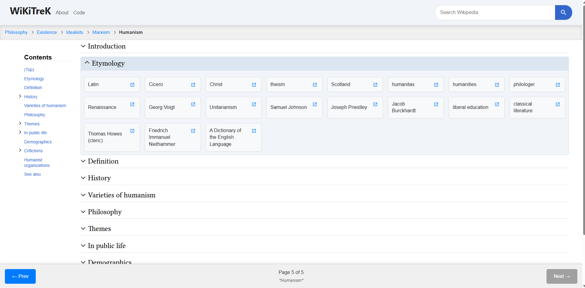

# WikiTrek 🗺️

Embark on an intellectual journey through the interconnected world of Wikipedia. WikiTrek is a web application designed to facilitate fun exploration of topics by allowing users to seamlessly navigate from one article to the next while always keeping track of their path.

---

### [Live Demo Link](https://utsav-bhandari.github.io/wiki-trek/)

## About The Project

While Wikipedia is a phenomenal resource, it's easy to get lost in a sea of tabs when exploring related topics. This application solves that problem by providing a single-page interface where users can search for an initial topic and then dive into related articles. The app dynamically fetches and displays links from each article, and a persistent breadcrumb trail tracks every step of your journey, making it easy to see how you got to your current page and to jump back to any previous point in your "trek."

##  Core Features

-   **Wikipedia Search**: Start your journey by searching for any Wikipedia article.
-   **Autocomplete Suggestions**: A fast, debounced search provides up to 6 suggestions as you type to help you find what you're looking for.
-   **Seamless Navigation**: Click on any link within an article to load it as the next step in your journey, without ever leaving the page.
-   **Interactive Breadcrumbs**: A horizontally scrolling breadcrumb trail visualizes your entire navigation path, allowing you to jump back to any previous article with a single click.
-   **Synchronized Navigation**: The main content view and the sidebar navigation are always in sync. Opening a section in one view automatically opens it in the other.

## Tech Stack

This project was built using a modern frontend stack:

-   **[React](https://reactjs.org/)**: A JavaScript library for building user interfaces.
-   **[React Query (`@tanstack/react-query`)](https://tanstack.com/query/latest)**: For server state management, including fetching, caching, and updating data from the API.
-   **JavaScript (ES6+)**: The core programming language.
-   **CSS3**: Custom styling using modern features like Flexbox, CSS Grid, and Custom Properties for a fully responsive design.
-   **[Wikipedia API](https://www.mediawiki.org/wiki/API:Main_page)**: Used to fetch article content, links, and search suggestions.

## License

Distributed under the MIT License. See `LICENSE` for more information.

## Acknowledgements

-   A big thank you to the **Wikimedia Foundation** for providing the free and open [Wikipedia API](https://www.mediawiki.org/wiki/API:Main_page) that makes this project possible.
